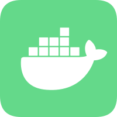

<p align="center">

</p>


<h1 align="center">Vocker</h1>

<p align="center">Docker client visual operation panel developed based on Nuxt stacks powered by AI
</p>

<p align="center">

</p>


## ✨Quickstart✨

### 🤤 You can run the command locally to start the server

``` bash
# npm
npm i vocker
npx vocker

# pnpm
pnpm i vocker
pnpm dlx vocker

# yarn
yarn add vocker
yarn dlx vocker

# bun
bun add vocker
bunx vocker
```

## 🛠️Development🛠️

### 🔗 Make sure to install the dependencies:

```bash
# npm
npm install

# pnpm
pnpm install

# yarn
yarn install

# bun
bun install
```

### 🖥️ Start the service running on the local port <8000> and a LAN IP address:

```bash
# npm
npm run dev

# pnpm
pnpm run dev

# yarn
yarn dev

# bun
bun run dev
```

### 🫡 When using the built-in chatbot, be sure to create a new dotenv file and attach your own private keys:

```
NUXT_OPEN_AI_SECRET_KEY=
NUXT_OPENAI_API_PROXY_URL=
```
